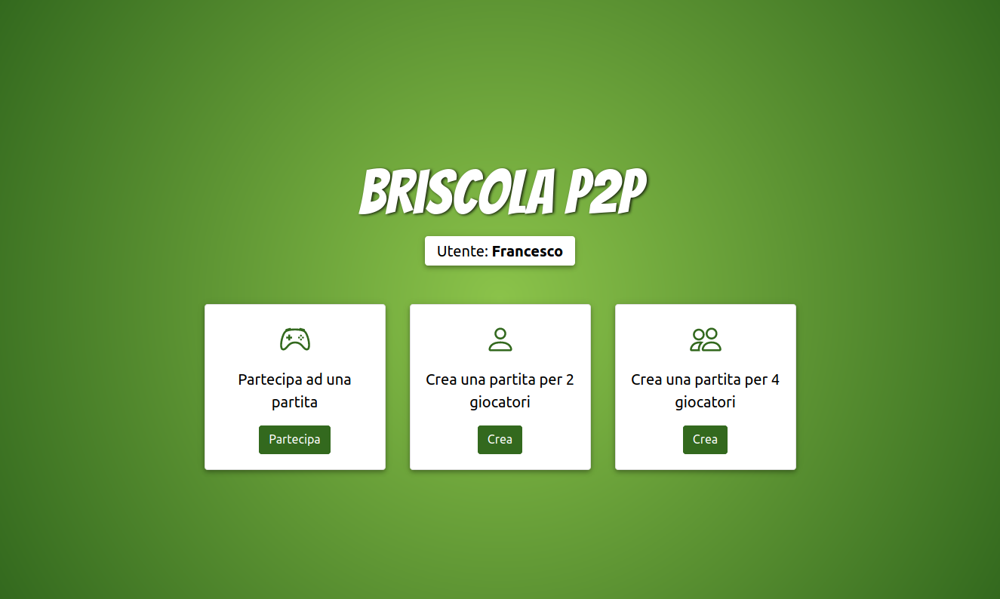
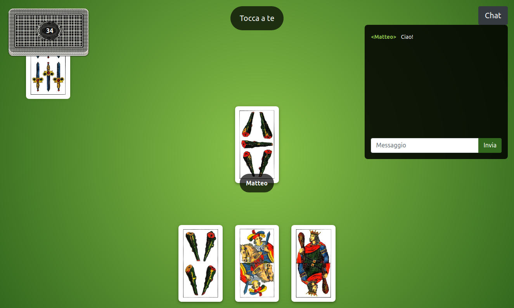

# Briscola P2P
Peer-To-Peer web application based on italian card game Briscola for a university project.\
This app is developed with [React](https://github.com/facebook/react), in particular using
[create-react-app](https://github.com/facebook/create-react-app), and implements a
[Mental Poker](https://en.wikipedia.org/wiki/Mental_poker) protocol for playing a fair game over
distance without the need for a trusted third party.





### Requirements
 - [Node](https://github.com/nodejs/node)
 - [npm](https://www.npmjs.com/)

### Installation
You need to install [PeerJS Server](https://github.com/peers/peerjs-server):
```
git clone https://github.com/peers/peerjs-server.git
cd peerjs-server/
npm install
```
Then, install Briscola P2P:
```
git clone https://github.com/franksacco/briscola-p2p.git
cd briscola-p2p/
npm install
```

### Run
Start PeerJS Server:
```
cd peerjs-server/
npm run start
```
Start server for match handling:
```
cd server/
node server.js
```
Start the web application (in development mode):
```
npm run start
```

## Authors
- [Francesco Saccani](https://github.com/franksacco) (francesco.saccani2@studenti.unipr.it)
- [Matteo Rinaldini](https://github.com/matterina) (matteo.rinaldini@studenti.unipr.it)